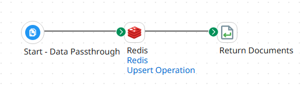

# Boomi Redis Connector

<p align="center">
  
</p>

A Boomi custom connector for Redis that enables high-throughput caching operations from Boomi integration processes and APIs. Supports standalone Redis, pooled standalone Redis, and Redis Cluster deployments — including Azure Cache for Redis with Microsoft Entra authentication.

## Documentation

This README is a quick-start overview. For the full technical documentation, see the **[technical docs](docs/README.md)** that links to:

- **[Getting Started](docs/getting-started.md)** — develop, build, and test the connector from a fresh clone to uploadable artifacts.
- **[Connection Configuration](docs/connection-configuration.md)** — every connection field, the clustering policies, and the three authentication modes.
- **[Operation Configuration](docs/operation-configuration.md)** — the GET / UPSERT / DELETE operations, their properties, and JSON request/response profiles.
- **[Deploying connector to the Boomi Platform](https://developer.boomi.com/docs/Connectors/DeployConnectors/Versioning_and_releasing_connector)** — Boomi's official documentation on deploying a connector to Boomi Integration.
- **[Updating the Connector Icon](docs/updating-connector-icon.md)** — how to update the connector's icon.

## Features

- **Operations**: GET, UPSERT, DELETE (single key and wildcard)
- **Authentication**: None, Basic (username/password), Microsoft Entra ID (OAuth 2.0 client credentials)
- **Deployment modes**: Standalone, connection-pooled standalone, Cluster
- **Clustering Policy**: Single Endpoint, OSS Cluster — see [Clustering Policy](#clustering-policy)
- **SSL/TLS**: Configurable; required for Azure Cache for Redis (port 6380)
- **Key prefixes**: Configurable per operation; prefix can be stripped from GET responses
- **TTL**: Configurable per UPSERT operation (in milliseconds); overridable at runtime
- **JSON profiles**: Request/response schemas auto-generated via Browse

## Clustering Policy

The connection's **Clustering Policy** field tells the connector how the target Redis presents its topology:

- **Single Endpoint** (default) — The client talks to one address and does no cluster routing. Choose this for a single Redis node (Azure Cache Basic/Standard, a self-hosted instance) or a proxy-fronted cluster that presents one endpoint — including Redis Enterprise / Redis Cloud databases using the "Enterprise" clustering policy and Azure Managed Redis configured with the Enterprise clustering policy. The proxy hides sharding, so the client treats it like a single server (standalone, optionally pooled, Jedis client).
- **OSS Cluster** — A client-sharded Redis Cluster that returns MOVED/ASK redirects; the client discovers the topology and routes keys itself. Choose this for Redis OSS cluster mode, AWS ElastiCache with cluster mode enabled, GCP Memorystore for Redis Cluster, Azure Managed Redis with the OSS clustering policy, or a self-hosted cluster-enabled deployment.

The **Hosts** field takes a single `host:port` endpoint for **Single Endpoint**; for **OSS Cluster** it accepts one or more comma-separated seed nodes (`host1:port1,host2:port2`) — any reachable seed lets the client discover the rest of the topology.

## Connector Architecture

- **SDK**: Boomi Connector SDK 2.22.1
- **Redis client**: Jedis 5.2.0 (Redis 6+ compatible)
- **Build**: Gradle with `com.boomi.connector` plugin

## Building

```bash
./gradlew build
```

This produces the connector archive and copies the descriptor to `build/connector-upload/`.

### Run unit tests (no Redis required)

```bash
./gradlew test
```

### Run integration tests (requires live Redis)

Copy the relevant properties file template from `src/test/resources/` and populate it with your connection details, then:

```bash
./gradlew integrationTest
```

## Installing in Boomi

1. Run `./gradlew build` to produce the artifacts in `build/connector-upload/`.
2. In the Boomi Enterprise Platform, navigate to **Settings → Developer**.
3. Create a new connector entry (or update an existing one).
4. Upload `BoomiRedisConnector-<version>.car` and `connector-descriptor.xml`.

Optionally update the connector icon using the Postman collection in `assets/postman/`.


---

*Fork of [BoomiCacheConnector](https://bitbucket.org/officialboomi/boomicacheconnector/src/master/) by anthony.rabiaza@gmail.com.*
