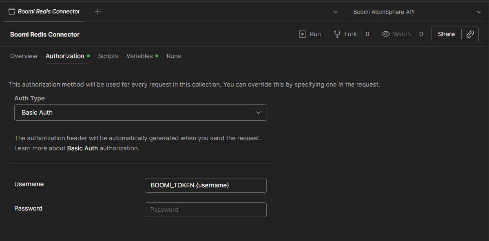
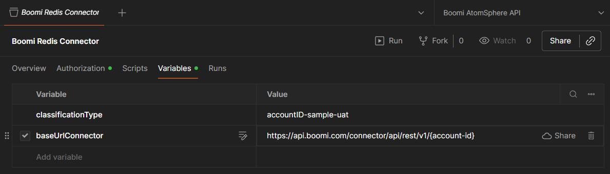
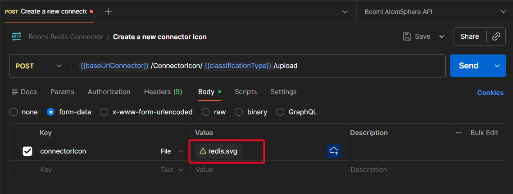

## Updating the Connector Icon

The connector icon can be updated using the Boomi Connector Icon API.

1. Open `assets/postman/boomi_redis_connector.postman_collection.json` in Postman.
2. Set Basic auth credentials in the **Authorization** tab (username: `BOOMI_TOKEN.<username>`).
3. Set the `classificationType` and `baseUrlConnector` variables in the **Variables** tab.
4. Attach `assets/postman/redis.svg` to the `connectorIcon` field in the request body.
5. Send the request and clear the browser cache to see the updated icon.

